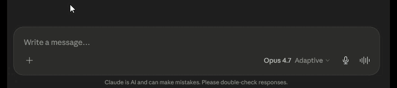

# flstudio-mcp

**Control FL Studio with Claude: AI mixing, composition, and mix diagnosis through natural language.**




*Claude diagnosing and fixing a mix in FL Studio through natural language.*

## Overview

flstudio-mcp is a Model Context Protocol (MCP) server that lets Claude Desktop drive FL Studio 2025 directly — the mixer, plugins, piano roll, routing, and project — from plain-language requests. Ask for a mix diagnosis, a vocal chain, a chord progression in a particular scale, or a full arrangement, and Claude carries it out through FL's scripting API and a set of calibrated, safety-checked tools.

It is genre- and producer-agnostic: nothing about it assumes a particular style of music.

## Quickstart

```bat
scripts\install_windows.bat        :: controller + server + note bridge
fl-studio-mcp-daemon               :: start the bridge, keep it running
```

Wire the two loopMIDI ports in FL (Options > MIDI Settings), arm `MCP_Apply` once in the piano roll, then ask Claude in plain language:

> "Scan my mix and tell me what's wrong." — "Set up a vocal chain from my plugins." — "Export this arrangement to MIDI."

Full setup is below.

## Capabilities

### Mixing & diagnosis
- **Mix Doctor** — scans the whole mix and reports concrete problems (clipping, low headroom, level imbalance, missing high-pass, ungrouped related tracks, overlapping EQ boosts), each with the exact evidence and a proposed fix. Fixes are applied one at a time, only on approval, through a snapshot → write → readback → rollback safety layer. Master clipping is resolved by trimming the contributing source tracks rather than pulling the master.
- **Full-song peak watch** — holds a running peak per track across playback, so level decisions are based on the loudest moment of the actual song, not a single instant.
- **Calibrated processing intents** — musical EQ, compression, reverb, and delay moves mapped to real plugin parameters (native and third-party), each applied as one reversible change.
- **Level-aware compression** — sets thresholds relative to a track's measured level during playback.
- **Gain staging** — proposes per-track trims toward a healthy level with proper master headroom.
- **Reference match** — compares your mix's level and tonal balance against a reference track.
- **Bulk track control** — solo or mute a whole group (drums, vocals, …) in one step, with a one-call reset.
- **Track & channel coloring** — color a track, a channel, or a whole group (drums, vocals, …) by color name or hex, reversible like every other change.

### Plugin & preset control
- Read and set plugin parameters by name, on native and third-party plugins (the parameter list is resolved live).
- **Chain suggestions** and **preset recommendations** drawn from your actual installed library — read directly from FL's plugin database and preset folders on disk, so recommendations are limited to what you own.

### Composition
- **Multi-track MIDI export** — generate a complete arrangement as a standard MIDI file to import.
- **Multi-pattern arrangement** — create, name, clone, and mark sections.
- **Note and chord writing** into the piano roll, with quantize to a grid (for new notes and existing ones).
- **Composition in any scale or mode** — Western modes, pentatonic, ragas, maqam, and beyond — through the scale composer, where Claude supplies the notes for the requested scale.

### Audio analysis
- Tempo and key estimation from an audio file.
- Melody-to-MIDI transcription (CREPE pitch tracking, with a lighter fallback).

The server exposes 67 tools across 14 categories, plus 6 live resources (project, mixer, transport, channels, patterns, status) that Claude can read directly.

## What sets it apart

flstudio-mcp is built as a mixing and production assistant, not only a note sender. It diagnoses and repairs a whole mix, makes decisions from real measured levels rather than guesswork, and is aware of your actual plugin and preset library when it makes suggestions. Every change that touches the project is shown before it is applied, logged, and reversible.

## Limitations

These are properties of FL Studio's scripting API, stated plainly:

- **Plugins, audio files, and rendering are UI-only.** FL's API cannot load a plugin, load an audio file, or render audio. The plugin and preset tools therefore *suggest* — you load the chosen plugin or preset, and Claude then configures it. Audio export is done manually (File > Export); Claude can analyze the rendered file afterward.
- **Note writing is armed once per session.** A generated pyscript writes notes into the piano roll; FL exposes no API to run a pyscript, so you run "MCP_Apply" once from the piano roll's scripting menu at the start of a session.
- **Micro-tonal and gamaka-heavy music is approximated.** Scales with intervals smaller than a semitone (e.g. Arabic maqam) are rounded to the nearest semitone, and traditions built on gamaka/ornamentation (e.g. Carnatic) get the *scale framework* — the correct swaras and intervals — not gamaka or micro-tonal rendering. That's a limit of 12-tone MIDI, not of the tools.

## Requirements

- **Windows 10/11** (tested on Windows 11)
- **FL Studio 2025** or newer
- **Claude Desktop** (or any MCP client)
- **Python 3.10+**
- **loopMIDI** — for the two virtual MIDI ports ([download](https://www.tobias-erichsen.de/software/loopmidi.html))
- Optional: **ffmpeg** on PATH (for MP3 analysis)

macOS and Linux are not yet supported — contributions welcome.

## Setup

1. **Create two virtual MIDI ports** in loopMIDI, named exactly `FLStudioMCP RX` and `FLStudioMCP TX`.

2. **Install the controller script and server:**
   ```bat
   git clone https://github.com/rosasynthesiz/flstudio-mcp
   cd flstudio-mcp
   scripts\install_windows.bat
   ```
   This copies the controller script, seeds the note-bridge pyscript (`MCP_Apply`), installs the server, and checks that your loopMIDI ports exist. For audio features, add the optional extras:
   ```bat
   pip install -e ".[audio]"                   :: tempo/key + melody analysis
   pip install -e ".[audio,audio-accurate]"    :: + CREPE (higher accuracy, ~500 MB)
   ```

3. **Configure FL Studio** — Options > MIDI Settings:
   - Enable `FLStudioMCP RX` as an **input**, set its controller type to **FLStudioMCP**, and give it a port number.
   - Enable `FLStudioMCP TX` as an **output** with the **same** port number.
   - View > Script output should show `[FLStudioMCP] Ready`.

4. **Start the bridge daemon** (recommended) so the MIDI port is held by a stable process:
   ```bat
   fl-studio-mcp-daemon
   ```

5. **Register the server with Claude Desktop** (`%APPDATA%\Claude\claude_desktop_config.json`):
   ```json
   {
     "mcpServers": {
       "fl-studio": {
         "command": "fl-studio-mcp",
         "env": { "FLSTUDIO_MCP_TRANSPORT": "tcp" }
       }
     }
   }
   ```
   `tcp` routes through the daemon, which works regardless of how Claude Desktop launches the server. Omit the env var to let the server open the MIDI ports directly instead.

6. **Arm the note bridge (per session)** — open the piano roll and run **MCP_Apply** once from its scripting menu, so note-writing works.

Verify the connection by asking Claude to call `fl_ping`.

## Troubleshooting

| Symptom | Fix |
|---|---|
| loopMIDI ports not found / not detected | The two ports must be named **exactly** `FLStudioMCP RX` and `FLStudioMCP TX`. Recreate them in loopMIDI and re-run the installer. |
| No `[FLStudioMCP] Ready` in FL's Script output | The controller isn't registered: set the `FLStudioMCP RX` input's **Controller type** to **FLStudioMCP** in MIDI Settings, confirm `device_FLStudioMCP.py` is in `Settings\Hardware\FLStudioMCP\`, then fully restart FL Studio. |
| Claude can't reach FL / `fl_ping` fails | Make sure the daemon is running (`fl-studio-mcp-daemon`); check the transport matches (`FLSTUDIO_MCP_TRANSPORT=tcp` uses the daemon, unset uses direct MIDI); restart Claude Desktop after editing its config. |
| Note-writing does nothing | Run `MCP_Apply` once from the piano roll's scripting menu this session — it arms the note bridge. |
| Audio tools error or are unavailable | Install the optional extras: `pip install -e ".[audio]"` (or `".[audio,audio-accurate]"`). |

## Usage examples

Plain-language prompts:

- "Scan my mix and tell me what's wrong."
- "Set up a vocal chain on the lead vocal using my plugins."
- "Suggest a vintage bass preset from my Serum library."
- "Compose an 8-bar melody in D Dorian and write it to the selected channel."
- "Export this arrangement to a MIDI file."
- "What tempo and key is this track?" (on an audio file)

## Architecture

A thin controller script runs inside FL Studio and returns only cheap, raw data; all judgement — diagnosis, calibration, planning — happens server-side. A standalone daemon owns the MIDI port so the server works regardless of how the MCP client is launched. Note authoring uses a generated pyscript bridge: the daemon re-triggers the armed `MCP_Apply` script with a keystroke (via pyautogui) after a brief window force-focus. Every project-modifying tool routes through a snapshot → write → readback → rollback safety layer backed by a persisted change log.

Design notes and findings are in [`docs/`](docs/).

## License

MIT — see [LICENSE](LICENSE).

## Status & contributing

Beta — the public 1.0 release. Windows-only for now; macOS and Linux contributions are welcome. Issues and pull requests: [github.com/rosasynthesiz/flstudio-mcp](https://github.com/rosasynthesiz/flstudio-mcp).
